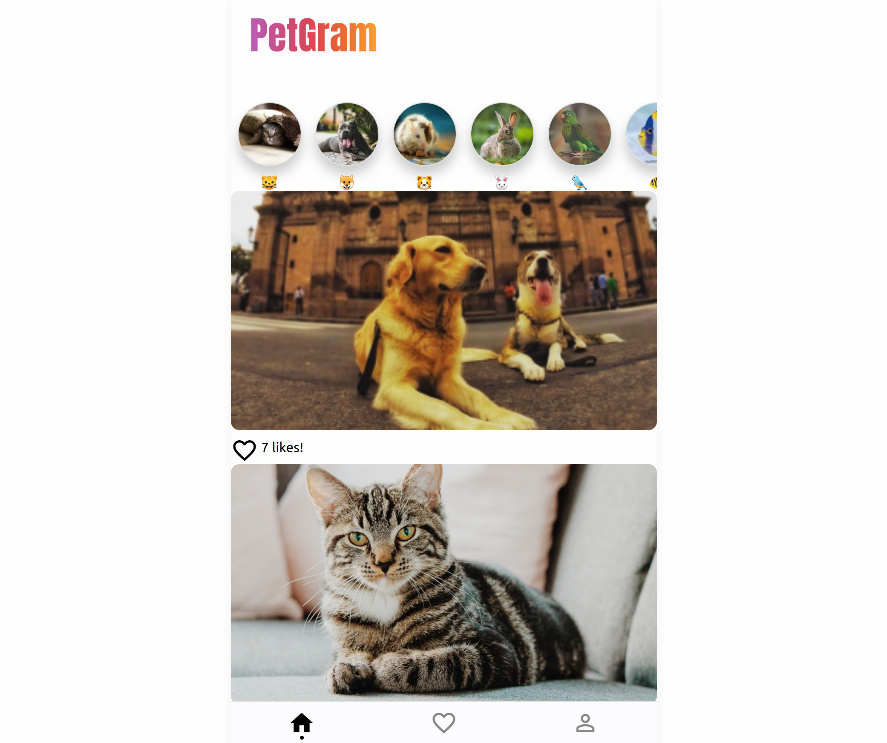

# PetGram

## Sitio

https://petgram-mr98.vercel.app

Simulando un clon de instagram con React Js, manejando el estado de la aplicación con Context Api.

## Empezar 

* `yarn` para instalar dependencias.
* `yarn run dev` para levantar entorno de desarrollo.
* `yarn run build` generar el bundle.
* `yarn start` Correr en entorno de producción.

## Licencia

MIT

